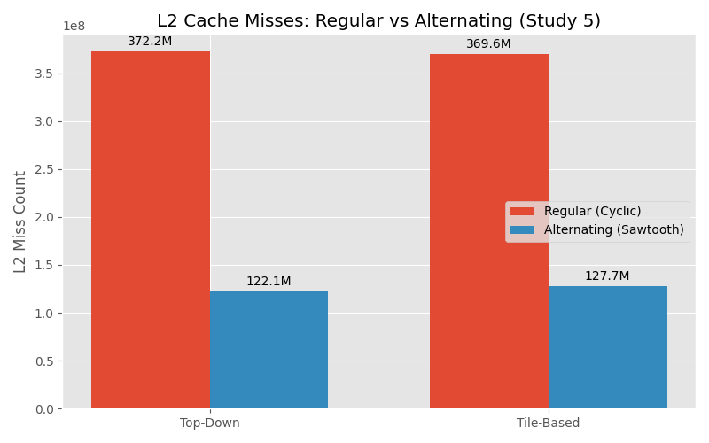
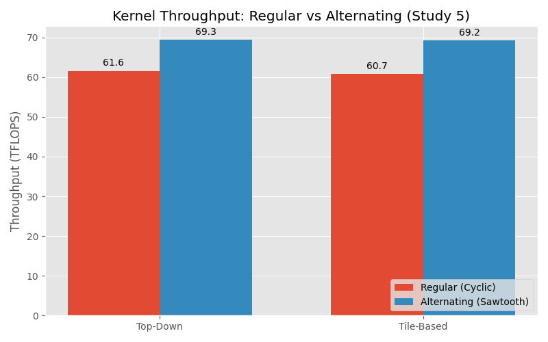
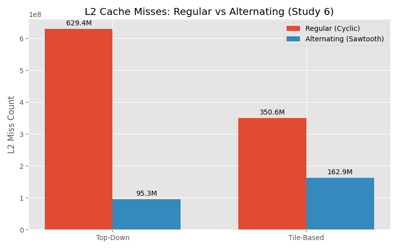
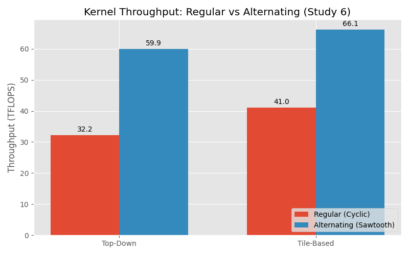

# AttnFMHA

This repository contains variants of the AttentionFMHA kernel, focusing on static, tile-based strategies, and their alternating counterparts.

## Variants

- **Full Static**: Top-down static scheduling.
- **Full Static Alt**: Top-down static scheduling with alternating (sawtooth) atomic updates.
- **Tile**: Tile-based scheduling.
- **Tile Alt**: Tile-based scheduling with alternating (sawtooth) atomic updates.

## Study 5: L2 Cache Misses & Throughput (Top-Down vs Tile-Based)

### Raw Data

| Variant | L2 Misses (Regular) | L2 Misses (Alternating) | Throughput (TFLOPS) Regular | Throughput (TFLOPS) Alternating |
| :--- | :--- | :--- | :--- | :--- |
| **Top-Down (Static)** | 372,244,480 | 122,117,820 | 61.58 | 69.34 |
| **Tile-Based** | 369,644,856 | 127,651,952 | 60.74 | 69.24 |

### Plots

## Study 6: Causal Masking Performance

### Raw Data

| Variant | L2 Misses (Regular) | L2 Misses (Alternating) | Throughput (TFLOPS) Regular | Throughput (TFLOPS) Alternating |
| :--- | :--- | :--- | :--- | :--- |
| **Top-Down (Static)** | 629,425,276 | 95,344,684 | 32.21 | 59.89 |
| **Tile-Based** | 350,626,172 | 162,876,760 | 41.05 | 66.11 |

### Plots

